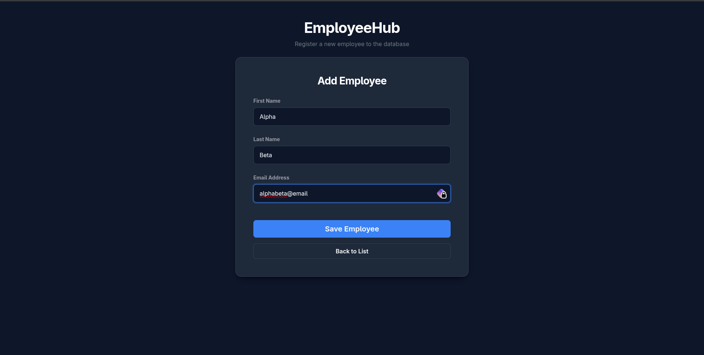
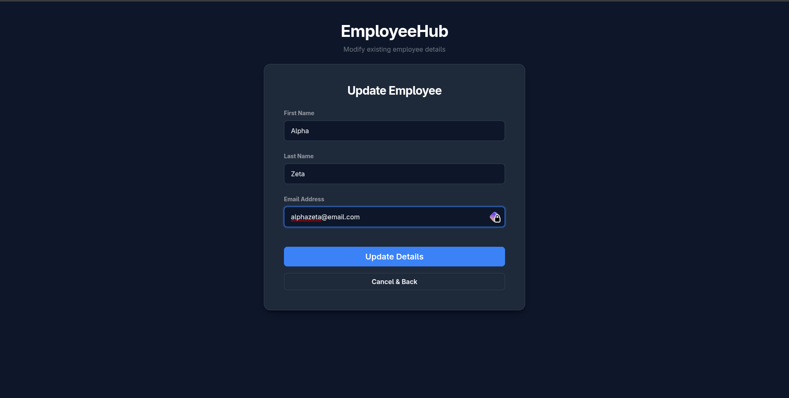
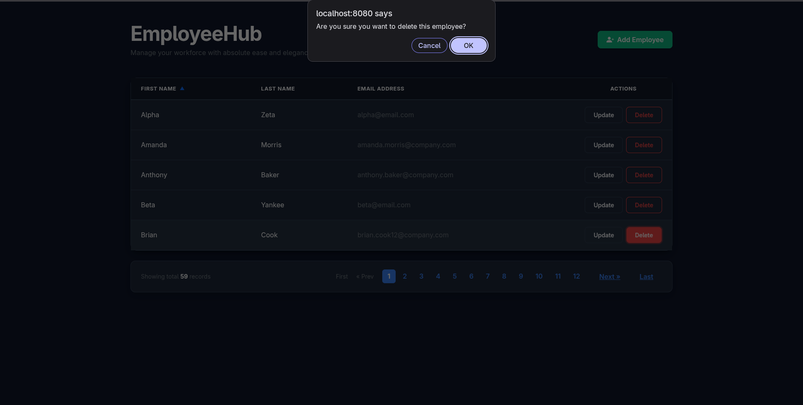
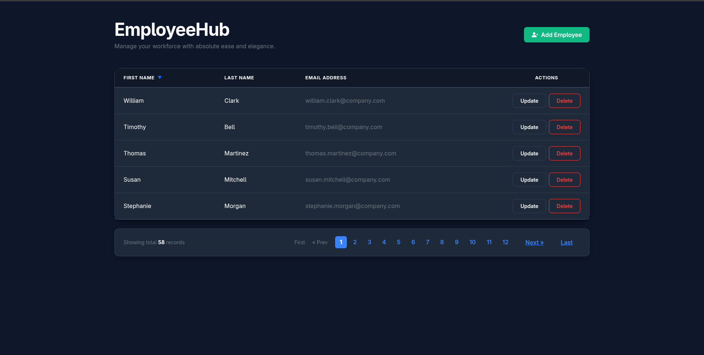
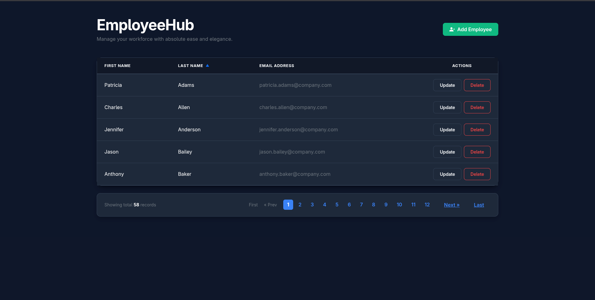
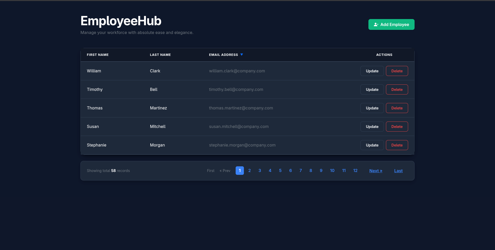
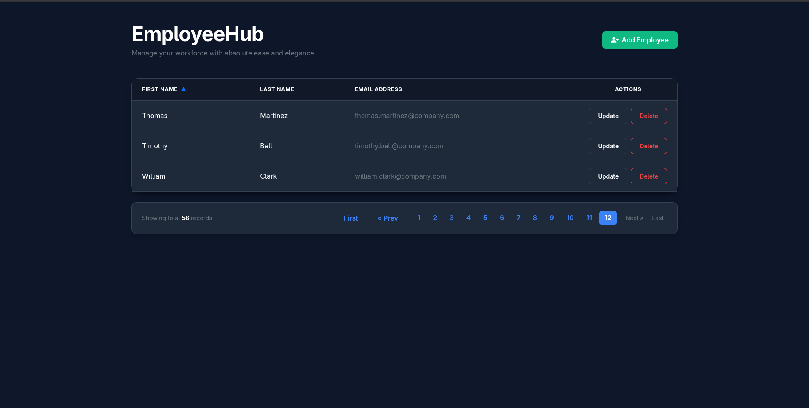

# EMPLOYEE HUB

An Employee Management Web Application built using Spring Boot, Spring MVC, Spring Data JPA, Hibernate, Thymeleaf, Bootstrap CSS, and MariaDB.

This project demonstrates CRUD operations using a web interface with proper layered architecture, database integration, server-side pagination, and dynamic sorting.

---

# HIGH LEVEL ARCHITECTURE


---

# FEATURES

- Create Employee
- Get All Employees (Dashboard view)
- Update Employee Details
- Delete Employee with JS confirmation alert
- Server-Side Pagination (Chunked database loading)
- Dynamic Sorting by fields (First Name, Last Name, Email) with sorting indicators (▲/▼)
- Simple Dark UI Theme (Bootstrap CSS & custom `style.css`)
- Environment Variable Configuration using `.env`
- Layered Architecture (Controller, Service, Repository)

---

# TECH STACK

| Technology | Purpose |
|------------|---------|
| Java 17 | Programming Language |
| Spring Boot 4.X | Backend Framework |
| Spring MVC | Web Controller Layer |
| Thymeleaf | Front-end Template Engine |
| Bootstrap v5 | CSS Styling |
| Spring Data JPA | Database Operations |
| Hibernate | ORM Framework |
| MariaDB | Relational Database |
| Maven | Dependency Management |

---

# PROJECT ARCHITECTURE

```txt
src/main/java/com/mydomain/springweb/employeehub
│
├── controller
│   └── EmployeeController.java
│
├── entity
│   └── Employee.java
│
├── repository
│   └── EmployeeRepository.java
│
├── service
│   ├── EmployeeService.java
│   └── EmployeeServiceImpl.java
│
└── EmployeehubApplication.java
```

---

# LAYERED ARCHITECTURE EXPLANATION

## Web / Controller Layer

Handles:
- HTTP Requests
- Request Mapping & Redirects
- Form Binding & Validation

Technology Used:
- Spring MVC
- `@Controller`

---

## Service Layer

Contains:
- Business Logic
- Pagination & Sorting logic
- Bridge between Controller and Repository

Technology Used:
- Service Interface & Implementation (`EmployeeService` and `EmployeeServiceImpl`)

---

## DAO / Repository Layer

Handles:
- Database Communication
- CRUD Operations

Technology Used:
- Spring Data JPA
- Hibernate

---

# EMPLOYEE ENTITY

```java
Employee
│
├── id
├── firstName
├── lastName
└── email
```

---

# ROUTES & ENDPOINTS

| Method | Endpoint | Description |
|--------|----------|-------------|
| GET | `/` | Redirects to default dashboard page (Page 1, sorted by firstName in ascending order) |
| GET | `/page/{pageNo}` | Gets paginated & sorted employee list (Supports `sortField` and `sortDir` query parameters) |
| GET | `/showNewEmployeeForm` | Renders the Add Employee page |
| POST | `/saveEmployee` | Saves the employee to database (Handles both new additions and updates) |
| GET | `/showFormForUpdate/{id}` | Renders the Update Employee page pre-populated with details |
| GET | `/deleteEmployee/{id}` | Deletes employee by ID |

---

# DATABASE CONFIGURATION

This project uses environment variables with `.env`.

## `.env`

```env
DB_URL=jdbc:mariadb://localhost:3306/employee_hub
DB_USERNAME=your_username
DB_PASSWORD=your_password
```

---

# application.properties

```properties
spring.application.name=employeehub

spring.config.import=optional:file:.env[.properties]

spring.datasource.url=${DB_URL}
spring.datasource.username=${DB_USERNAME}
spring.datasource.password=${DB_PASSWORD}

spring.datasource.driver-class-name=org.mariadb.jdbc.Driver

spring.jpa.hibernate.ddl-auto=update
spring.jpa.properties.hibernate.dialect=org.hibernate.dialect.MariaDBDialect
spring.jpa.show-sql=true
```

---

# DEPENDENCIES USED

- spring-boot-starter-webmvc
- spring-boot-starter-thymeleaf
- spring-boot-starter-data-jpa
- mariadb-java-client
- spring-boot-starter-validation
- spring-boot-devtools

---

# HOW TO RUN THE PROJECT

## 1. Clone Repository

```bash
git clone https://github.com/hello-aaditya/springboot-playground.git
```

---

## 2. Navigate to Project Directory

```bash
cd springboot-playground/employeehub
```

---

## 3. Create Database

Run this in your database console:

```sql
CREATE DATABASE employee_hub;
```

---

## 4. Configure Environment Variables

Create a `.env` file in the project root:

```env
DB_URL=jdbc:mariadb://localhost:3306/employee_hub
DB_USERNAME=root
DB_PASSWORD=your_password
```

---

## 5. Run Application

```bash
./mvnw spring-boot:run
```

OR run directly from Eclipse/STS/VS Code.

---

# APP SCREENSHOTS & WORKFLOW

Here is the step-by-step visual workflow of the application:

### Home Page (Dashboard)


---

### Add Employee Form


---

### Update Employee Form


---

### Delete Employee Confirmation


---

### Sorting Employees by First Name


---

### Sorting Employees by Last Name (Ascending)


---

### Sorting Employees by Last Name (Descending)


---

### Last Page & Pagination Navigation


---

# FUTURE IMPROVEMENTS

- DTO Layer for mapping entities
- REST API support alongside Thymeleaf views
- Security features using Spring Security and JWT
- Docker support for easier deployment
- Unit & integration testing with JUnit and Mockito

---

# AUTHOR

Aaditya Kumar

---

# LICENSE

This project is developed for learning and educational purposes.
