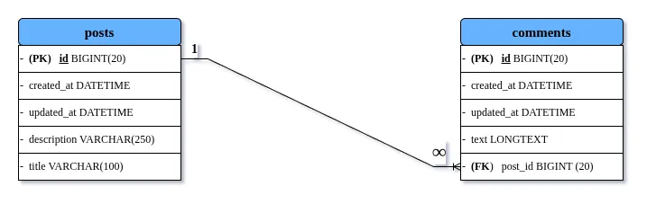

# ONE-TO-MANY MAPPING USING SPRING BOOT, JPA & HIBERNATE

A simple Spring Boot project demonstrating **Unidirectional One-To-Many Mapping** using **Spring Data JPA** and **Hibernate**.

This project demonstrates how a single `Post` can contain multiple `Comments` using JPA entity relationship mapping.

This project is mainly created for learning and understanding entity relationship mapping in Spring Data JPA.

---

# HIGH LEVEL ARCHITECTURE



---

# FEATURES

- Create a `Post`
- Add Multiple `Comments`
- Unidirectional One-To-Many Mapping
- JPA Relationship Mapping
- Foreign Key Handling using `@JoinColumn`
- Cascade Operations using `CascadeType.ALL`
- Environment Variable Configuration using `.env`
- Automatic Table Creation using Hibernate

---

# TECH STACK

| Technology | Purpose |
|------------|---------|
| Java 17 | Programming Language |
| Spring Boot 4.x | Backend Framework |
| Spring Data JPA | Database Operations |
| Hibernate | ORM Framework |
| MariaDB | Relational Database |
| Maven | Dependency Management |

---

# PROJECT ARCHITECTURE

```txt
src/main/java/com/mydomain/springweb/onetomanymapping
│
├── entity
│   ├── Post.java
│   └── Comment.java
│
├── repository
│   ├── PostRepository.java
│   └── CommentRepository.java
│
└── SpringbootHibernateOneToManyMappingApplication.java
```

---

# ENTITY RELATIONSHIP EXPLANATION

## Post Entity

```java
@OneToMany(cascade = CascadeType.ALL)
@JoinColumn(name="postComment_fid", referencedColumnName = "id")
List<Comment> comments = new ArrayList<>();
```

### Explanation

| Annotation | Purpose |
|------------|---------|
| `@OneToMany` | Defines one-to-many relationship |
| `CascadeType.ALL` | Propagates all operations to child entities |
| `@JoinColumn` | Creates foreign key in child table |
| `postComment_fid` | Foreign key column name |

---

# HOW MAPPING WORKS

When a `Post` is saved:

1. Post gets inserted into `posts` table
2. All comments get inserted into `comments` table
3. Hibernate automatically sets foreign key values

Example:

| comments.id | text | postComment_fid |
|---|---|---|
| 1 | Mapping topic is interesting | 1 |
| 2 | Unidirectional Mapping | 1 |
| 3 | Important Topic | 1 |

---

# SAMPLE DATA USED

```java
Post post = new Post(
    "Learn One-To-Many Mapping using JPA and Hibernate",
    "Description: Learn One-To-Many Mapping using JPA and Hibernate"
);

Comment comment1 = new Comment("Mapping topic is interesting.");
Comment comment2 = new Comment("Unidirectional Mapping.");
Comment comment3 = new Comment("Important Topic.");

post.getComments().add(comment1);
post.getComments().add(comment2);
post.getComments().add(comment3);

postRepository.save(post);
```

---

# DATABASE TABLES

## posts

| Column | Type |
|---|---|
| id | BIGINT |
| title | VARCHAR |
| description | VARCHAR |

---

## comments

| Column | Type |
|---|---|
| id | BIGINT |
| text | VARCHAR |
| postComment_fid | BIGINT (FK) |

---

# DATABASE CONFIGURATION

This project uses environment variables with `.env`.

## `.env`

```env
DB_URL=jdbc:mariadb://localhost:3306/your_database_name
DB_USERNAME=your_username
DB_PASSWORD=your_password
```

---

# application.properties

```properties
spring.application.name=springboot-hibernate-one-to-many-mapping

spring.config.import=optional:file:.env[.properties]

# DATABASE CONFIGURATION
spring.datasource.url=${DB_URL}
spring.datasource.username=${DB_USERNAME}
spring.datasource.password=${DB_PASSWORD}
spring.datasource.driver-class-name=org.mariadb.jdbc.Driver

# HIBERNATE SETTINGS
spring.jpa.hibernate.ddl-auto=update
spring.jpa.show-sql=true
spring.jpa.properties.hibernate.dialect=org.hibernate.dialect.MariaDBDialect
```

---

# DEPENDENCIES USED

- spring-boot-starter-data-jpa
- mariadb-java-client
- spring-dotenv
- spring-boot-devtools

---

# HOW TO RUN THE PROJECT

## 1. Clone Repository

```bash
git clone https://github.com/hello-aaditya/springboot-playground.git
```

---

## 2. Navigate to Project Directory

```bash
cd springboot-hibernate-one-to-many-mapping
```

---

## 3. Configure Environment Variables

Create `.env`

```env
DB_URL=jdbc:mariadb://localhost:3306/your_database_name
DB_USERNAME=root
DB_PASSWORD=your_password
```

---

## 4. Build Project

### Linux / macOS

```bash
./mvnw clean install
```

### Windows

```cmd
mvnw.cmd clean install
```

---

## 5. Run Application

### Linux / macOS

```bash
./mvnw spring-boot:run
```

### Windows

```cmd
mvnw.cmd spring-boot:run
```

---

# OUTPUT

After running the application:

- One `Post` record gets inserted
- Three `Comment` records get inserted
- Foreign key relationship is automatically maintained by Hibernate

---

# IMPORTANT NOTES

## Why `CascadeType.ALL`?

It ensures:

- Save parent → child automatically saved
- Delete parent → child automatically deleted
- Update parent → child updated

---

## Why `@JoinColumn`?

Without `@JoinColumn`, Hibernate creates an additional join table.

Using:

```java
@JoinColumn(name="postComment_fid")
```

directly creates foreign key inside `comments` table.

---

# FUTURE IMPROVEMENTS

- Bidirectional Mapping
- REST APIs
- DTO Layer
- Service Layer
- Validation using `@Valid`
- Swagger/OpenAPI Documentation
- Spring Security
- Docker Support
- Unit Testing

---

# AUTHOR

Aaditya Kumar

---

# LICENSE

This project is developed for learning and educational purposes.