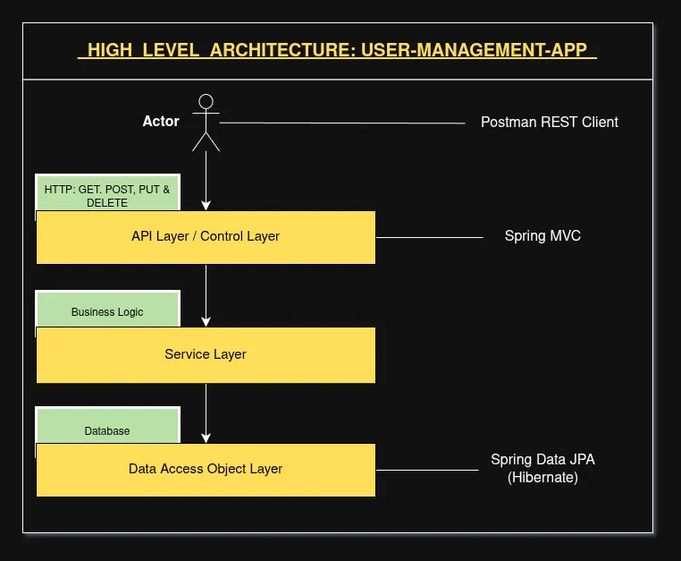

# USER MANAGEMENT APP

A RESTful User Management API built using Spring Boot, Spring MVC, Spring Data JPA, Hibernate, and MariaDB.

This project demonstrates CRUD operations using REST APIs with proper layered architecture and database integration.

---

# HIGH LEVEL ARCHITECTURE



---

# FEATURES

- Create User
- Get All Users
- Get User By ID
- Update User
- Delete User
- Exception Handling
- RESTful API Design
- Environment Variable Configuration using `.env`
- Layered Architecture

---

# TECH STACK

| Technology | Purpose |
|------------|---------|
| Java 17 | Programming Language |
| Spring Boot 4 | Backend Framework |
| Spring MVC | REST API Development |
| Spring Data JPA | Database Operations |
| Hibernate | ORM Framework |
| MariaDB | Relational Database |
| Maven | Dependency Management |
| Postman | API Testing |

---

# PROJECT ARCHITECTURE

```txt
src/main/java/com/mydomain/springweb/userrestapi
│
├── controller
│   └── UserController.java
│
├── entity
│   └── User.java
│
├── repository
│   └── UserRepository.java
│
├── exception
│   └── ResourceNotFoundException.java
│
└── UserManagementAppApplication.java
```

---

# LAYERED ARCHITECTURE EXPLANATION

## API / Controller Layer

Handles:
- HTTP Requests
- Request Mapping
- API Endpoints

Technology Used:
- Spring MVC
- `@RestController`

---

## Service Layer

Contains:
- Business Logic
- Data Processing

(Currently repository is used directly for simplicity.)

---

## DAO / Repository Layer

Handles:
- Database Communication
- CRUD Operations

Technology Used:
- Spring Data JPA
- Hibernate

---

# USER ENTITY

```java
User
│
├── id
├── firstName
├── lastName
└── email
```

---

# API ENDPOINTS

| Method | Endpoint | Description |
|--------|----------|-------------|
| POST | `/add-user` | Create New User |
| GET | `/users` | Get All Users |
| GET | `/user/{userId}` | Get User By ID |
| PUT | `/user/{userId}` | Update Existing User |
| DELETE | `/user/{userId}` | Delete User |

---

# SAMPLE JSON REQUEST

## CREATE USER

```json
{
  "firstName": "Aaditya",
  "lastName": "Kumar",
  "email": "aaditya@example.com"
}
```

---

# DATABASE CONFIGURATION

This project uses environment variables with `.env`.

## `.env`

```env
DB_URL=jdbc:mariadb://localhost:3306/springbootDB2
DB_USERNAME=your_username
DB_PASSWORD=your_password
```

---

# application.properties

```properties
spring.application.name=user-management-app

spring.config.import=optional:file:.env[.properties]

spring.datasource.url=${DB_URL}
spring.datasource.username=${DB_USERNAME}
spring.datasource.password=${DB_PASSWORD}

spring.datasource.driver-class-name=org.mariadb.jdbc.Driver

spring.jpa.hibernate.ddl-auto=update
spring.jpa.show-sql=true
```

---

# DEPENDENCIES USED

- spring-boot-starter-webmvc
- spring-boot-starter-data-jpa
- mariadb-java-client
- spring-dotenv
- spring-boot-devtools

---

# HOW TO RUN THE PROJECT

## 1. Clone Repository

```bash
git clone https://github.com/hello-aaditya/springboot-playground.git
```

---

## 2. Navigate to Project Directory

```bash
cd springboot-playground/user-management-app
```

---

## 3. Configure Environment Variables

Create `.env`

```env
DB_URL=jdbc:mariadb://localhost:3306/springbootDB2
DB_USERNAME=root
DB_PASSWORD=your_password
```

---

## 4. Run Application

```bash
./mvnw spring-boot:run
```

OR run directly from STS/Eclipse.

---

# TESTING APIs

You can test APIs using:

- Postman
- Thunder Client
- curl

---

# EXCEPTION HANDLING

Custom exception:

```java
ResourceNotFoundException
```

returns:

```http
404 NOT FOUND
```

when requested user does not exist.

---

# FUTURE IMPROVEMENTS

- DTO Layer
- Service Interface Layer
- Validation using `@Valid`
- Swagger/OpenAPI Documentation
- JWT Authentication
- Spring Security
- Docker Support
- Unit Testing
- Pagination & Sorting

---

# AUTHOR

Aaditya Kumar

---

# LICENSE

This project is developed for learning and educational purposes.
